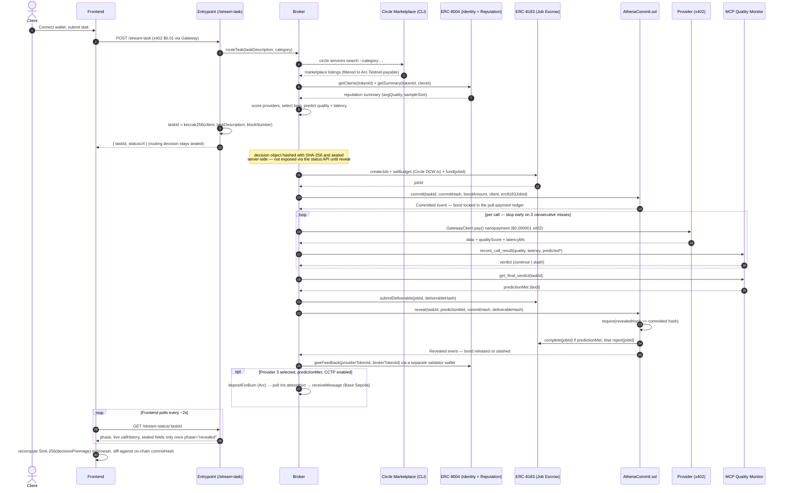

# Athena
### Trust-minimized streaming agent broker on Arc · Lepton Agents Hackathon
**Deadline:** July 6, 2026, 11:59 PM ET · **Submission:** forms.gle/SMqLaw2pMGDe58LFA
**Team:** Backend A (contracts) · Backend B (payments/stream/agents) · Frontend (dashboard)

Athena is a trust-minimized agent broker on Arc that routes work between independently built x402-protected agents, commits its routing logic and prediction before execution, and uses USDC collateral plus on-chain reveal to make broker trust verifiable instead of assumed.

---

## One-line problem

AI agent brokers are already causing expensive mistakes, fraud, and fast operational damage, but there is still no trust-minimized way to prove that a broker routed honestly, predicted responsibly, and accepted financial consequences when it was wrong.

## Intro

As AI agents move from chat tools to economic actors, the hard problem is no longer just whether an agent can do the task. The harder problem is whether we can trust the broker that selects, routes, and vouches for other agents, especially when real money and real decisions are involved. Athena is built for that gap: it makes broker decisions commit-reveal based, collateral-backed, and reputation-aware so routing becomes economically accountable on-chain.

## Market context

| Problem area | Real stat | What happened | Why Athena matters |
|---|---|---|---|
| Expensive agent failures | 64% of billion-dollar enterprises reported losing more than $1M from AI agent failures in the past year. | Agents and brokers are being trusted with decisions that humans cannot audit fast enough. | Athena forces the broker to commit to routing reasoning and prediction before execution, then reveals it later and slashes the bond if it lied or mispredicted. |
| AI fraud and bot-driven abuse | Consumer fraud losses reached $12.5 billion, and nearly 60% of companies reported increased losses from 2024 to 2025. | "Machine-to-machine mayhem" is making it harder to tell legitimate agent activity from fraud in commerce flows. | Athena seals broker decisions on-chain and backs them with collateral, making agent-to-agent routing auditable instead of blind. |
| Fast autonomous damage | Confirmed AI agent financial security incidents produced about $15.6 million in documented losses. | Agentic systems can move too quickly once they have real access, with prompt injection and integration weaknesses causing rapid damage. | Athena limits broker-side harm by making routing decisions, predictions, and reputation updates tamper-evident and financially accountable. |

### Three problem layers

**1) Broker trust failures cause expensive AI mistakes.** AI agent failures are already costing real money at enterprise scale: a SalesforceBen-cited research summary says 64% of billion-dollar enterprises lost more than $1M because of AI agent failures in the past year. The pattern is usually not one dramatic hack; it is an agent or broker making opaque, poorly supervised, or overconfident decisions that humans cannot easily audit in time. Athena solves this by forcing the broker to commit to its routing reasoning and prediction before the task runs, then revealing that reasoning later and slashing the broker's USDC bond if the reveal does not match the commit or the prediction fails.

**2) AI-driven fraud is becoming a billion-dollar problem.** Experian's 2026 fraud forecast, reported by Fortune, says consumer fraud losses reached $12.5 billion, and nearly 60% of companies reported increased losses from 2024 to 2025. The report warns about "machine-to-machine mayhem," where good bots and bad bots interact in the same commerce flow, making it harder to tell legitimate actions from fraud. Athena reduces this trust gap by requiring every broker decision to be sealed on-chain and backed by collateral, so a broker cannot quietly route to a bad provider, claim a false rationale, and walk away without financial consequences.

**3) Agentic systems can cause fast, high-impact damage.** Regent Protocol's 2023–2026 incident analysis says confirmed AI agent financial security incidents have produced about $15.6 million in documented losses. That incident corpus highlights weaknesses like inability to verify AI autonomy, integration-point vulnerabilities, and prompt-injection susceptibility, which can cause rapid damage once agents are given real access. Athena does not try to solve every agent security issue; it specifically reduces broker-side harm by making routing decisions, outcome predictions, and reputation updates tamper-evident and financially accountable on Arc.

## What Athena does

Athena sits between a client and multiple independent agent services. The broker evaluates available providers, forms a routing decision, makes a falsifiable prediction about the task outcome, hashes that reasoning, and commits it on-chain before the task runs. After the provider finishes, the broker reveals the reasoning, the contract checks whether the reveal matches the commitment and whether the prediction was correct, and the USDC bond is either released or slashed automatically.

## How it solves the problem

Athena solves three related issues at once. First, opaque routing: the broker can no longer silently choose providers for hidden reasons because it must commit to its reasoning first. Second, overconfident promises: the broker must stake USDC on its prediction, so inaccurate judgment has a financial cost. Third, weak accountability: the bond and reveal make the routing decision auditable, not just logged in a private dashboard.

## What is used

Athena uses the Arc / Circle stack directly:

- **x402 and Gateway** for payment-triggered task access and nanopayments.
- **Circle Developer-Controlled Wallets** for the provider agents (the broker stays a plain EOA — see `BACKEND_B_README.md` for why).
- **USDC on Arc** for task payments, escrow, and slashing.
- **Solidity contracts** for commit-reveal and escrow logic.
- **ERC-8004** for agent identity and reputation.
- **ERC-8183** for job escrow (Athena as evaluator).
- **CCTP V2** for the Phase 4 cross-chain payout stretch goal.
- **Arc Testnet** for fast settlement and live demoability.

## Why this is better than a normal broker

A normal broker can claim it chose the best provider and leave you to trust that story. Athena turns that story into a financial commitment that can be checked later. That is the key shift: it does not merely route tasks, it makes routing decisions economically provable.

---

## How this scores against every judging criterion

| Criterion | Weight | How Athena scores |
|---|---|---|
| Agentic Sophistication | 30% | Athena makes two autonomous decisions per stream — who to route to AND what quality/latency to predict — both sealed before the stream starts, both have real USDC consequences. Self-bootstraps via Circle skills with no human writing integration code. MCP monitor decides in real-time whether to continue or slash. Full autonomy, not automation. |
| Traction | 30% | Every stream = multiple on-chain nanopayment transactions. Each routing decision = a commit + bond + reveal. Running 10 streams = 50+ real on-chain transactions logged on Arcscan. Log every milestone via `arc-canteen update traction` throughout the build window. Cross-team traction: other Lepton teams building x402 services can plug their endpoints in as Athena providers. |
| Circle Tool Usage | 20% | Agent Wallets (per agent, policy-controlled), Gateway/Nanopayments (per-call stream), x402 (HTTP payment trigger per call), Circle CLI + skills (autonomous setup), Agent Marketplace (provider discovery), Contracts (AthenaCommit.sol + ERC-8183), USDC throughout, CCTP V2 (Phase 4 cross-chain). |
| Innovation | 20% | Commit-reveal tied to a falsifiable per-call prediction — not just "did it succeed" but "did it match what I specifically predicted" — with streaming nanopayments as the economic primitive rather than a lump payment. MCP as a live stream quality oracle. Not in any prior art we found. |

---

## 4 README files in this repo

| File | Owner | What it covers |
|---|---|---|
| `README.md` | Everyone reads | This file — index, shared facts, handoff map, judging alignment |
| `BACKEND_A_README.md` | Backend A | Contracts: AthenaCommit.sol, ERC-8183 integration, ERC-8004 registration, CCTP Phase 4 |
| `BACKEND_B_README.md` | Backend B | Stream loop, x402 payments, Circle CLI/wallets, deterministic broker logic, MCP quality monitor |
| `FRONTEND_README.md` | Frontend | All 6 pages, state management, data flow, component breakdown |

---

## Shared facts — pin these, never re-derive mid-build

| Fact | Value |
|---|---|
| Chain ID | `5042002` (hex `0x4cef52`) |
| RPC | `arc-canteen rpc-url` after `arc-canteen login` (Canteen-hosted proxy) |
| Backup RPC | `https://rpc.testnet.arc.network` |
| Explorer | `https://testnet.arcscan.app` |
| Faucet | `https://faucet.circle.com` (select Arc Testnet) |
| Native gas | USDC |
| USDC ERC-20 (use this for all amounts) | `0x3600000000000000000000000000000000000000` — **6 decimals** |
| USDC native interface | **18 decimals** (gas only — never use this for payment amounts) |
| ERC-8004 IdentityRegistry | `0x8004A818BFB912233c491871b3d84c89A494BD9e` |
| ERC-8004 ReputationRegistry | `0x8004B663056A597Dffe9eCcC1965A193B7388713` |
| ERC-8183 job escrow (Arc) | `0x0747EEf0706327138c69792bF28Cd525089e4583` |
| CCTP V2 TokenMessengerV2 (Arc, domain 26) | `0x8FE6B999Dc680CcFDD5Bf7EB0974218be2542DAA` |
| CCTP V2 MessageTransmitterV2 | `0xE737e5cEBEEBa77EFE34D4aa090756590b1CE275` |
| Circle Gateway facilitator (Arc testnet) | `https://gateway-api-testnet.circle.com` · network `eip155:5042002` |
| Circle Agent Marketplace | `https://agents.circle.com/services` |
| Circle skills setup | `curl -sL https://agents.circle.com/skills/setup.md` |
| Solidity pragma | `^0.8.28` |
| OpenZeppelin | `5.x` — `PaymentSplitter` REMOVED, use manual split. `ReentrancyGuardTransient` available. |
| Canteen CLI install | `uv tool install git+https://github.com/the-canteen-dev/ARC-cli` |
| Circle CLI install | `npm install -g @circle-fin/cli` (Node v20.18.2+) |
| Reference repo | `github.com/the-canteen-dev/circle-agent` + `circlefin/arc-nanopayments` |

⚠️ **USDC decimals rule — read once, remember always:** all payment amounts, bond amounts, escrow amounts use the **6-decimal ERC-20 interface**. The 18-decimal native interface is gas only. Mixing these is the #1 bug on Arc — if a number looks wrong by a factor of a trillion, this is why.

⚠️ **`anvil` is not Arc.** Local Foundry simulator cannot reproduce Arc's blocklist enforcement, native precompiles, or EIP-7708 Transfer logs. Unit tests: `anvil`. Integration tests: real Arc Testnet RPC.

⚠️ **`circle services pay` has no loop/stream mode.** It makes one payment per invocation. Backend B implements the stream loop in application code using `GatewayClient` + `fetchWithPayment` from `@circle-fin/x402-batching/client`. This is confirmed — do not waste time searching for a `--loop` flag that does not exist.

---

## The stream flow (everyone must understand this before writing code)

This is the real, currently-implemented flow (see `BACKEND_B_README.md` and `backend/PENDING.md` for the bug-hunt history behind a few of these steps — the ERC-8004/ERC-8183 ABIs in particular didn't match the interfaces on the first attempt, and the sealed-until-reveal mechanism was a later hardening pass, not the original design).



---

## Cross-team handoff map — critical path

| # | From | To | When | What |
|---|---|---|---|---|
| H1 | Backend A | Backend B + Frontend | End Phase 1 | `AthenaCommit.sol` function signatures so B can call commit/reveal, Frontend can read events |
| H2 | Backend B | Backend A | End Phase 1 | 3 provider agent wallet addresses + roles (for ERC-8004 registration) |
| H3 | Backend A ↔ Backend B | mutual | End Phase 1 | Agreed `taskId` generation scheme — both must use identical scheme |
| H4 | Backend A | Backend B + Frontend | Phase 2 | Deployed contract address + exported ABI to `shared/` — **ping both actively, don't just commit** |
| H5 | Backend A | Frontend | Phase 2 | Agent `tokenId`s after ERC-8004 registration → `shared/addresses.json` |
| H6 | ALL | ALL | Phase 2 end | Full manual loop: commit → bond → single provider call → reveal → slash/release — works live |
| H7 | Backend B | Frontend | Phase 3 | Status websocket/endpoint for live stream progress display |
| H8 | Backend B | Frontend | Phase 3 | MCP monitor's per-call quality scores surfaced so frontend can show stream health live |
| H9 | ALL | ALL | Phase 3 end | Full automated stream: client pays once → stream runs → bond resolves — zero manual steps |

---

## Repo structure

```
athena/
├── contracts/              # Backend A owns
│   ├── src/
│   │   ├── AthenaCommit.sol
│   │   └── AthenaEscrow.sol   (or use ERC-8183 directly)
│   ├── test/
│   ├── script/Deploy.s.sol
│   └── foundry.toml
├── backend/                # Backend B owns
│   ├── stream/             # GatewayClient stream loop
│   ├── agents/             # Broker routing logic (plain TS, no framework) + provider agents
│   ├── mcp-monitor/        # FastMCP quality evaluator (Python)
│   └── cctp/               # Phase 4 cross-chain payout
├── frontend/               # Frontend owns
│   └── (Next.js)
├── shared/                 # Backend A writes, everyone reads
│   ├── addresses.json
│   └── abis/
├── README.md
├── BACKEND_A_README.md
├── BACKEND_B_README.md
└── FRONTEND_README.md
```

**Rule:** `shared/addresses.json` is Backend A's file. Nobody else edits it. Nobody hardcodes an address from memory. If it's stale, ping Backend A.

---

## Submission checklist

- [ ] Register on Luma: `https://luma.com/5xcrazms` (GitHub + Discord handle required)
- [ ] Join Canteen Discord: `https://discord.gg/rsVfYutFZg` — introduce yourselves, say what you're building
- [ ] Join Arc builder Discord: `https://discord.com/invite/buildonarc` — mention Canteen + Lepton in onboarding
- [ ] Install Canteen CLI: `uv tool install git+https://github.com/the-canteen-dev/ARC-cli`
- [ ] Install Circle CLI: `npm install -g @circle-fin/cli`
- [ ] Submit provider agents to marketplace: `forms.gle/7YFzvdmMcn1JH5tF6` — do this Day 1, approval takes time
- [ ] Log traction updates regularly: `arc-canteen update traction` — not just once at submission
- [ ] Log product updates: `arc-canteen update product`
- [ ] Public GitHub repo (required)
- [ ] Video demo under 3 minutes — Loom/YouTube/Vimeo (required)
- [ ] Live deployed link (optional but strongly encouraged)
- [ ] Submit: `forms.gle/SMqLaw2pMGDe58LFA` — resubmit as many times as needed before deadline

---

## When something breaks and you don't know whose problem it is

1. Numbers look wrong by a huge factor → USDC decimal mismatch (18 vs 6). Check which interface you're reading.
2. Contract call reverts unexpectedly → check `taskId` matches agreed scheme (H3), check bond amount is 6-decimal
3. Stream payments not going through → confirm agent wallet has Gateway balance deposited, not just wallet balance
4. Hash mismatch on reveal → confirm you're hashing the structured JSON object, not any LLM-generated text
5. Data looks stale → `shared/addresses.json` is outdated, ping Backend A
6. MCP monitor not triggering → confirm it's running on `streamable-http` transport, not stdio
7. Blocked on a handoff → say so immediately. Silent waiting is the #1 team-killer in a hackathon.
